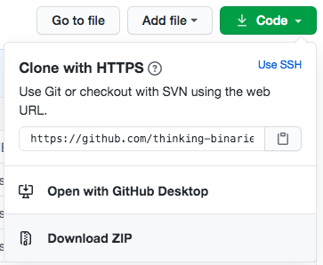

# micro:bit wearables

A 10 lesson course all about wearables, music, games, and coding.

To download this course:

Click on the green 'CODE' button (above ---^)

Choose 'Download Zip'

Each of the .hex files can then be dropped into the MakeCode editor here:

http://makecode.microbit.org
